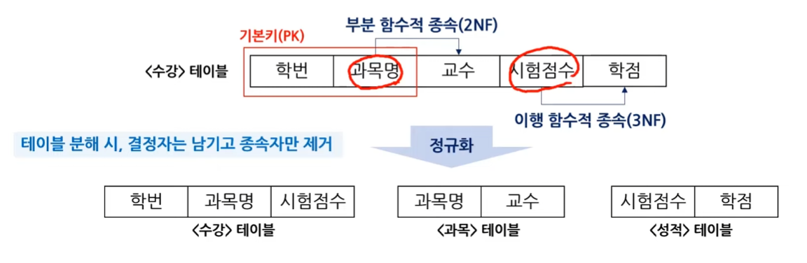

# 정규화

## 정규화란?

데이터 중복을 줄이고 **삽입·갱신·삭제 이상**을 방지하기 위해 데이터를 구조적으로 분해하고 정리하는 과정.

즉, 하나의 테이블에 뒤섞여 있는 데이터를 적절한 테이블로 분리하여 데이터의 **무결성을 유지하고 관리하기 쉽게 만드는 것**.

## 이상 현상 (Anomaly)

- **삽입 이상**

  새로운 데이터를 삽입할 때 다른 불필요한 데이터도 함께 삽입해야 하는 현상

- **갱신 이상**

  중복된 데이터 중 일부만 수정되어 데이터의 불일치가 발생하는 현상

- **삭제 이상**

  특정 데이터를 삭제할 때 의도하지 않은 데이터까지 함께 삭제되는 현상


## 함수적 종속

### 함수적 종속이란?
- **결정자 A 속성에 의해 종속자 B 속성이 유일하게 결정되는 관계 (A→B)**

### 함수적 종속의 종류

- **완전 함수적 종속**

  종속자가 기본키의 모든 속성에 종속적인 경우
  - Ex) **시험 점수**는 기본키인 학번과 과목명을 모두 알아야 알 수 있다.

- **부분 함수적 종속**

  종속자가 기본키의 일부 속성에 종속적인 경우
  - Ex) **교수**는 기본키의 일부인 과목명만 알아도 알 수 있다.


## 정규화

### 제1정규화 (1NF)
**모든 도메인(속성의 값)이 원자 값(더 이상 쪼갤 수 없는 값)이어야 한다.**

#### ❌ 1NF 적용 전
|학번|이름|과목명|
|---|---|---|
|101|홍길동|데이터베이스, 인공지능|
> `과목명`에 2개의 값이 저장되어 1NF를 위반한다.

#### ✅ 1NF 적용 후

|학번|이름|과목명|
|---|---|---|
|101|홍길동|데이터베이스|
|101|홍길동|인공지능|
> `과목명`에 하나의 값만 저장되도록 행을 분리하여 원자값을 만족한다.
---

### 제2정규화 (2NF)
**부분 함수적 종속을 제거하여 기본키 전체에 종속되도록 한다.**
> 제1정규형을 만족하면서 모든 비주요 속성이 기본키 전체에 완전 함수적 종속되어야 한다.

#### ❌ 2NF 적용 전

|🔑학번|🔑과목명|이름|교수|
|---|---|---|---|
|101|데이터베이스|홍길동|김교수|
|101|인공지능|홍길동|이교수|
|102|데이터베이스|김철수|김교수|

> `이름`은 **학번**만으로 결정되고, `교수`는 **과목명**만으로 결정된다.  
> 즉, 기본키의 일부에만 종속되는 **부분 함수적 종속**이 발생하여 2NF를 위반한다.

#### ✅ 2NF 적용 후

**학생**

|🔑학번|이름|
|---|---|
|101|홍길동|
|102|김철수|

**과목**

|🔑과목명|교수|
|---|---|
|데이터베이스|김교수|
|인공지능|이교수|

**수강**

|🔑학번|🔑과목명|
|---|---|
|101|데이터베이스|
|101|인공지능|
|102|데이터베이스|

> `이름`은 **학번**에, `교수`는 **과목명**에 종속되도록 테이블을 분리하여 부분 함수적 종속을 제거했다.

---

### 제3정규화 (3NF)
**이행적 함수 종속을 제거하여 비기본키가 다른 비기본키에 종속되지 않도록 한다.**
> 제2정규형을 만족하면서 모든 비주요 속성이 기본키에 이행적으로 종속되지 않아야 한다.

#### ❌ 3NF 적용 전

|🔑학번|이름|학과|학과장|
|---|---|---|---|
|101|홍길동|컴퓨터공학과|김교수|
|102|김철수|컴퓨터공학과|김교수|
|103|이영희|경영학과|이교수|

> `학과장`은 기본키인 **학번**에 직접 종속되는 것이 아니라 **학과**를 통해 결정된다.
>
> `학번 → 학과 → 학과장`
>
> 이처럼 비주요 속성이 다른 비주요 속성을 거쳐 기본키에 종속되는 **이행적 함수적 종속**이 발생하여 3NF를 위반한다.

#### ✅ 3NF 적용 후

**학생**

|🔑학번|이름|학과|
|---|---|---|
|101|홍길동|컴퓨터공학과|
|102|김철수|컴퓨터공학과|
|103|이영희|경영학과|

**학과**

|🔑학과|학과장|
|---|---|
|컴퓨터공학과|김교수|
|경영학과|이교수|

> `학과`와 `학과장`을 별도의 테이블로 분리하여 **이행적 함수적 종속을 제거했다.**



*2, 3정규화 간단 예시*

> #### 정규화 팁
> 테이블 분해 시 **결정자는 남기고 종속자만 제거**한다.
> - 위 사진에서 결정자인 학번, 과목명, 시험점수를 기준으로 테이블을 분해한 것을 알 수 있다.

---
### 반정규화
**정규화된 테이블을 의도적으로 다시 통합하거나 중복을 허용하여 데이터 조회 성능을 향상시키는 작업**
> 정규화는 **중복 제거**와 **무결성 보장**이라는 장점이 있지만, 지나치게 정규화하면 여러 테이블을 조인해야 하는 등 조회 성능이나 쿼리의 복잡성이 증가할 수 있다.

#### 정규화의 문제점
1. **조인 증가**

    데이터를 여러 테이블로 분리하면서 조회 시 필요한 조인이 증가한다.

2. **쿼리 복잡성 증가**

    여러 테이블을 조합해야 하므로 쿼리가 복잡해질 수 있다.

3. **조회 성능 저하**

    과도한 조인으로 인해 데이터 조회 성능이 저하될 수 있다.

4. **과도한 분리**

    데이터의 특성이나 사용 목적에 비해 지나치게 테이블을 분리하면 오히려 관리와 조회가 불편해질 수 있다.

    
> 💡 반정규화는 정규화를 무시하는 것이 아니라 **성능과 데이터 무결성 사이에서 적절한 균형을 찾는 과정**이다.
---

## 참고 자료

### 🔑 키(Key)

- **슈퍼키**
  - 유일성을 만족하는 키
- **후보키**
  - 유일성과 최소성을 만족하는 슈퍼키
- **기본키 (PK)**
  - 후보키 중 선택된 키
- **대체키**
  - 후보키 중 기본키로 선택되지 않은 키


### 🔗 키(Key) 간 관계

```text
슈퍼키
└── 후보키
    ├── 기본키 (PK)
    └── 대체키
```
---